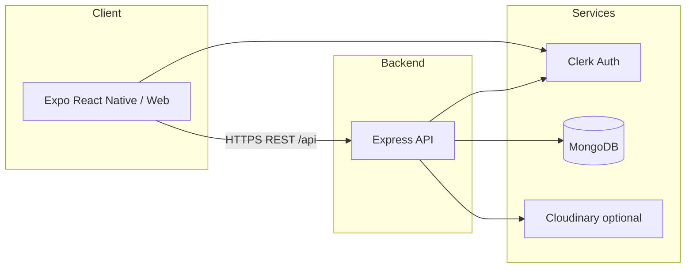
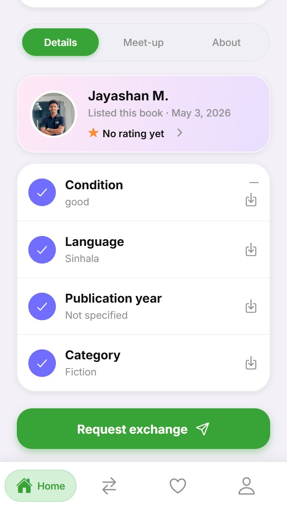
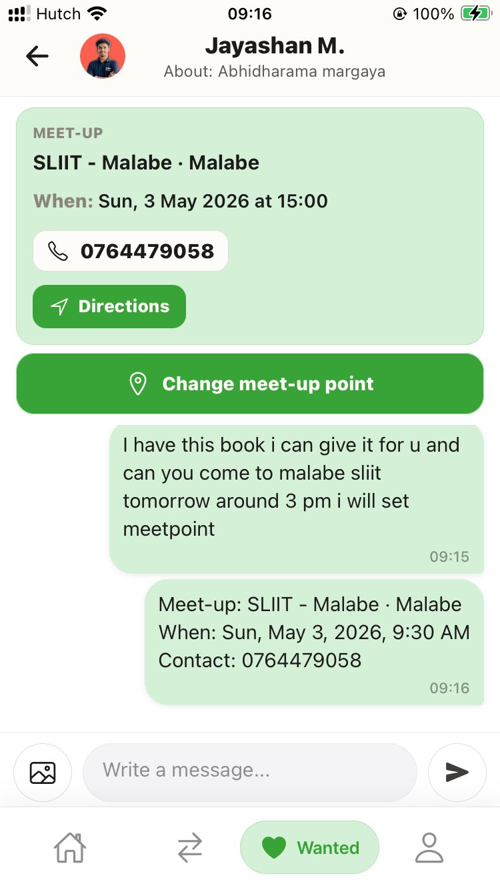
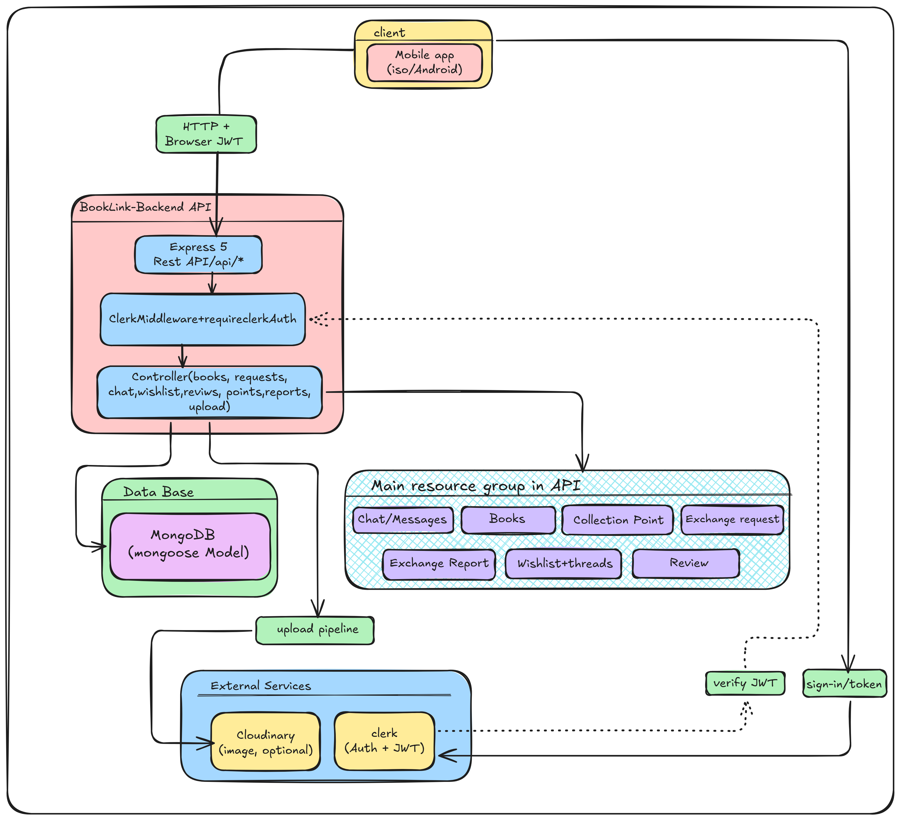
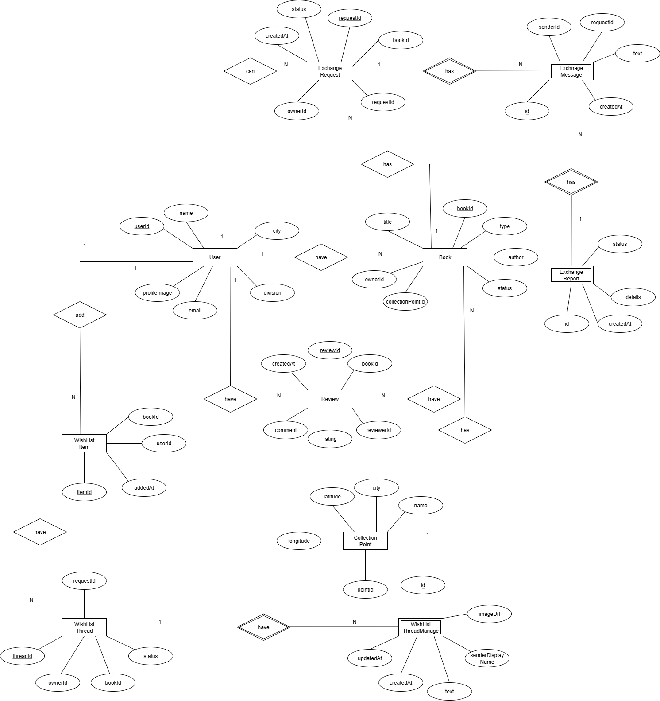

# BookLink

## Table of contents

### Background and product

- **1** · [Project name](#1-project-title)
- **2** · [What BookLink is](#2-project-description)
- **3** · [Problem we address](#3-problem-statement)
- **4** · [Goals and objectives](#4-objectives)
- **5** · [Features](#5-features)

### Technology stack

- **6** · [Technologies overview](#6-technologies-used)
- **7** · [Programming languages](#7-programming-languages)
- **8** · [Frameworks and libraries](#8-frameworks-and-libraries)
- **9** · [Tools and software](#9-tools-and-software-used)

### Requirements

- **10** · [System requirements](#10-system-requirements)
- **11** · [Hardware requirements](#11-hardware-requirements)
- **12** · [Software requirements](#12-software-requirements)

### Setup and daily use

- **13** · [Installation](#13-installation-guide)
- **14** · [First-time setup](#14-setup-instructions)
- **15** · [Configuration](#15-configuration-steps)
- **16** · [Using the application](#16-usage-instructions)
- **17** · [Run the project locally](#17-how-to-run-the-project)

### Structure and design

- **18** · [High-level project structure](#18-project-structure)
- **19** · [Full folder tree](#19-folder-structure)
- **20** · [Architecture diagram](#20-architecture-diagram)
- **21** · [System design](#21-system-design)
- **22** · [Database design](#22-database-design)
- **23** · [Entity–relationship diagram](#23-er-diagram)
- **24** · [UML diagrams](#24-uml-diagrams)

### API and implementation

- **25** · [REST API endpoints](#25-api-endpoints)
- **26** · [User roles and permissions](#26-user-roles-and-permissions)
- **27** · [Modules and components](#27-modulescomponents)
- **28** · [Algorithms](#28-algorithms-used)
- **29** · [Data structures](#29-data-structures-used)

### Documentation extras

- **30** · [Screenshots & diagram gallery](#30-screenshots)
- **31** · [Demo video](#31-demo-video-link)
- **32** · [Testing approach](#32-testing-information)
- **33** · [Test cases](#33-test-cases)

### Reflection

- **34** · [Challenges faced](#34-challenges-faced)
- **35** · [Limitations](#35-limitations)
- **36** · [Future improvements](#36-future-improvements)

### People, meta, and legal

- **37** · [Contributors](#37-contributors--team-members)
- **38** · [Individual responsibilities](#38-individual-member-responsibilities)
- **39** · [References](#39-references)
- **40** · [Acknowledgements](#40-acknowledgements)
- **41** · [Version information](#41-version-information)
- **42** · [Deployment](#42-deployment-information)
- **43** · [GitHub repository link](#43-github-repository-link)
- **44** · [Contact](#44-contact-information)
- **45** · [License](#45-license)
- **46** · [Copyright](#46-copyright-information)

### Support and closing

- **47** · [FAQs](#47-faqs-optional)
- **48** · [Support](#48-support-information)
- **49** · [Known issues and bugs](#49-known-issuesbugs)
- **50** · [Conclusion](#50-conclusion)

---

## 1. Project title

**BookLink**

## 2. Project description

BookLink is a community app for listing books and arranging **in-person exchanges**: browse listings, send exchange requests, chat with listers, manage a wishlist, leave reviews, and report issues. The product is a **React Native (Expo)** client with an **Express** API backed by **MongoDB**, using **Clerk** for authentication. This repository is maintained as a **personal project** (single maintainer).

## 3. Problem statement

Coordinating trusted, **local, face-to-face book swaps** is fragmented across social posts and ad hoc messaging. BookLink aims to centralize **listings, requests, meet-ups, and feedback** so readers can exchange books with clearer expectations and a lightweight trust layer (profiles, reviews, reports).

## 4. Objectives

- Let users **publish and discover** book listings and “wanted” posts.
- Support the **exchange lifecycle**: request → accept → schedule meet-up → confirm completion → optional review.
- Provide **chat** for exchange and wishlist threads and **notifications** where configured.
- Offer **collection points**, **reports**, and **reviews** to support safer in-person handoffs.

## 5. Features

- **Accounts:** Sign-in via Clerk (e.g. Google); profile sync and stats.
- **Browse & listings:** Search/filter books; detail views; CRUD for own listings.
- **Exchange requests:** Pending/accepted/rejected/cancelled flows; meet-up scheduling; per-request chat.
- **Wishlist:** Wanted posts, helper threads, optional meet-up coordination.
- **Collection points:** Submit and manage handoff locations (map-assisted where implemented).
- **Reviews:** Rate after accepted exchanges; view user reputation summaries.
- **Reports:** File and track complaints tied to exchanges; lister/reporter views.
- **Push:** Expo push integration on supported builds (see deployment and env docs).

## 6. Technologies used

Details appear in **sections 7 through 9** below (languages, frameworks/libraries, tools).

## 7. Programming languages

| Area | Languages |
| ---- | --------- |
| Frontend | **TypeScript** (primary), **JavaScript** (some shared `lib`/config) |
| Backend | **JavaScript** (ES modules) |

## 8. Frameworks and libraries

| Layer | Stack |
| ----- | ----- |
| Mobile / Web UI | **Expo** (~54), **React Native**, **React Navigation** |
| Auth | **Clerk** (`@clerk/clerk-expo`, `@clerk/express`) |
| HTTP client | **Axios** (Frontend) |
| API | **Express** 5, **Mongoose** |
| Uploads | **Multer**, **Cloudinary** (optional) |

## 9. Tools and software used

- **Node.js** (LTS), **npm** — install and run Backend and Frontend.
- **MongoDB** — database (Atlas or self-hosted via `MONGODB_URI`).
- **Expo CLI / EAS** — dev server and builds (`eas.json` in Frontend).
- **Git** — version control.
- **Clerk Dashboard** — OAuth redirects, JWT settings, app keys.

## 10. System requirements

- **Development:** Windows, macOS, or Linux; network access for MongoDB, Clerk, and optional Cloudinary.
- **Runtime (app):** iOS / Android / Web via Expo; device or emulator for native features.

## 11. Hardware requirements

- **Development:** Typical developer PC or laptop (multi-core, **8 GB+ RAM** recommended for Android emulator + Metro + API).
- **Devices:** Physical phone optional; use LAN IP in `EXPO_PUBLIC_API_URL` when the API runs on another host.

## 12. Software requirements

- **Node.js** LTS (e.g. **v20+**), **npm**
- **MongoDB** reachable from the API
- For native targets: **Xcode** (iOS) / **Android Studio** (Android) as per Expo docs

## 13. Installation guide

1. Clone this repository.
2. **Backend:** `cd Backend` → `npm install`.
3. **Frontend:** `cd Frontend` → `npm install`.

Details and verification steps: **[How to run the project](./HOW_TO_RUN.md)**.

## 14. Setup instructions

- Create **`Backend/.env`** and **`Frontend/.env`** (do not commit secrets). Variable tables and examples are in **[HOW_TO_RUN.md](./HOW_TO_RUN.md)**.
- Register a **Clerk** application and align keys between backend and frontend.
- Provision a **MongoDB** database and set `MONGODB_URI`.

## 15. Configuration steps

- **Clerk:** Match publishable/secret keys and redirect URLs to your Expo web, native bundle IDs, and dev URLs.
- **CORS:** Set `CLIENT_ORIGIN` on the backend for Expo web origins if needed.
- **API URL:** Set `EXPO_PUBLIC_API_URL` for real devices and Expo web so the app can reach the API.
- **Cloudinary:** Optional; required for full image upload flows (`CLOUDINARY_*` on backend).

## 16. Usage instructions

- **Backend:** Runs as an HTTP API (default port **5000** unless `PORT` is set). Health check: `GET /api/health`.
- **Frontend:** Start Metro with `npm start` in `Frontend`, then open **web** (`w`), **Android** (`a`), or **iOS** (`i`).
- Signed-in users browse books, create listings, manage requests/chats/wishlist from the tab navigation.

## 17. How to run the project

See **[HOW_TO_RUN.md](./HOW_TO_RUN.md)** — dependencies, environment variables, starting API and Expo, Clerk alignment, and troubleshooting.

## 18. Project structure

| Area | Responsibility |
| ---- | ---------------- |
| **Frontend** | Expo app: navigation, screens, API client, auth, theme. |
| **Backend** | REST API under `/api/*`, Clerk JWT validation, Mongoose models, Cloudinary uploads when configured. |

Logical **modules** map to routes and screens: books, exchange requests & chat, wishlist, collection points, reviews, reports, users, uploads, push.

## 19. Folder structure

Omitting generated folders (`node_modules`, `dist`, `.expo`, `.expo-export-test`) and local `.env` files.

```
BookLink/
├── BACKEND_API_ENDPOINTS.md
├── HOW_TO_RUN.md
├── README.md
├── docs/
│   ├── diagrams/
│   └── screenshots/
├── pics/
│   ├── diagrams/
│   │   ├── Database_Schema_Diagram.png
│   │   └── System_Architecture_Diagram.png
│   ├── ss1.png
│   ├── ss2.png
│   ├── ss3.png
│   ├── ss4.png
│   └── ss5.png
├── Backend/
│   ├── package.json
│   ├── package-lock.json
│   ├── server.js
│   └── src/
│       ├── app.js
│       ├── db.js
│       ├── config/
│       │   └── cloudinary.js
│       ├── constants/
│       │   ├── bookTypes.js
│       │   └── collectionPointCities.js
│       ├── controllers/
│       │   ├── bookController.js
│       │   ├── chatInboxController.js
│       │   ├── chatNotificationsController.js
│       │   ├── exchangeReportController.js
│       │   ├── exchangeRequestController.js
│       │   ├── pointController.js
│       │   ├── pushController.js
│       │   ├── reviewController.js
│       │   ├── uploadController.js
│       │   ├── userController.js
│       │   └── wishlistController.js
│       ├── lib/
│       │   └── chatUnreadCounts.js
│       ├── middleware/
│       │   └── requireClerkAuth.js
│       ├── models/
│       │   ├── Book.js
│       │   ├── CollectionPoint.js
│       │   ├── ExchangeMessage.js
│       │   ├── ExchangeReport.js
│       │   ├── ExchangeRequest.js
│       │   ├── PushDeviceToken.js
│       │   ├── Review.js
│       │   ├── UserProfile.js
│       │   ├── WishlistItem.js
│       │   ├── WishlistThread.js
│       │   └── WishlistThreadMessage.js
│       ├── routes/
│       │   ├── bookRoutes.js
│       │   ├── chatRoutes.js
│       │   ├── exchangeReportRoutes.js
│       │   ├── exchangeRequestRoutes.js
│       │   ├── pointRoutes.js
│       │   ├── pushRoutes.js
│       │   ├── reviewRoutes.js
│       │   ├── uploadRoutes.js
│       │   ├── userRoutes.js
│       │   └── wishlistRoutes.js
│       ├── services/
│       │   ├── chatMobilePush.js
│       │   ├── sendExpoPushNotifications.js
│       │   └── unifiedChatInbox.js
│       └── utils/
│           ├── bookFormValidation.js
│           ├── chatImageUrl.js
│           ├── collectionPointValidation.js
│           ├── listerDisplayName.js
│           └── meetupValidation.js
└── Frontend/
    ├── App.tsx
    ├── app.json
    ├── eas.json
    ├── index.js
    ├── package.json
    ├── package-lock.json
    ├── tsconfig.json
    ├── assets/
    │   ├── adaptive-icon.png
    │   ├── favicon.png
    │   ├── icon.png
    │   └── splash-icon.png
    └── src/
        ├── components/
        │   ├── BrowseBooksFilterModal.tsx
        │   ├── ChatImageLightbox.tsx
        │   ├── ChatListRow.tsx
        │   ├── ChatMessageRow.tsx
        │   ├── CityDictionarySelect.tsx
        │   ├── ClerkUserSync.tsx
        │   ├── CourseScreenShell.tsx
        │   ├── FormImageAttachment.tsx
        │   ├── GoogleBrandSignInButton.tsx
        │   ├── GoogleGLogo.tsx
        │   ├── leafletEmbedHtml.ts
        │   ├── LeafletLocationMapPicker.tsx
        │   ├── LocationMapPicker.android.tsx
        │   ├── LocationMapPicker.native.tsx
        │   ├── LocationMapPicker.tsx
        │   ├── LocationMapPicker.web.tsx
        │   ├── locationMapPickerTypes.ts
        │   ├── MeetupDateTimePickers.tsx
        │   ├── SignInGateCard.tsx
        │   └── SignInWithGoogleButton.tsx
        ├── constants/
        │   ├── bookTypes.ts
        │   ├── collectionPointCities.ts
        │   └── sriLankaDivisions.ts
        ├── hooks/
        │   └── useGoogleClerkSignIn.ts
        ├── lib/
        │   ├── api.js
        │   ├── bookFormText.ts
        │   ├── collectionPointFormRules.ts
        │   ├── mapsLinks.ts
        │   ├── meetupFormRules.ts
        │   ├── pickChatImage.ts
        │   ├── platformAlert.js
        │   ├── reviewFormRules.ts
        │   └── uploadChatImage.ts
        ├── navigation/
        │   ├── BrowseStack.tsx
        │   ├── browseStackTypes.ts
        │   ├── MainTabs.tsx
        │   ├── navigationRef.ts
        │   ├── ProfileStack.tsx
        │   ├── profileStackTypes.ts
        │   ├── PushNotificationsSetup.tsx
        │   ├── RequestsStack.tsx
        │   ├── requestsStackTypes.ts
        │   ├── RootGate.tsx
        │   ├── sharedScreenTypes.ts
        │   ├── webNavigationA11y.ts
        │   ├── WishlistStack.tsx
        │   └── wishlistStackTypes.ts
        ├── screens/
        │   ├── AddBookScreen.tsx
        │   ├── BookDetailScreen.tsx
        │   ├── BrowseAllBooksScreen.tsx
        │   ├── BrowseListScreen.tsx
        │   ├── BrowsePointsScreen.tsx
        │   ├── ChatsInboxScreen.tsx
        │   ├── EditListingScreen.tsx
        │   ├── EditProfileScreen.tsx
        │   ├── ExchangeRequestDetailScreen.tsx
        │   ├── LandingScreen.tsx
        │   ├── ListerReportsReceivedScreen.tsx
        │   ├── MyListingsScreen.tsx
        │   ├── MyPointsScreen.tsx
        │   ├── MyReportsScreen.tsx
        │   ├── MyReviewsScreen.tsx
        │   ├── NotificationsScreen.tsx
        │   ├── PostWantedBookScreen.tsx
        │   ├── ProfilePlaceholderScreen.tsx
        │   ├── ProfileScreen.tsx
        │   ├── ReportExchangeScreen.tsx
        │   ├── RequestChatScreen.tsx
        │   ├── RequestExchangeScreen.tsx
        │   ├── RequestsScreen.tsx
        │   ├── SubmitPointScreen.tsx
        │   ├── UserReviewsScreen.tsx
        │   ├── WantedBookDetailScreen.tsx
        │   ├── WishlistBoardScreen.tsx
        │   ├── WishlistChatsScreen.tsx
        │   ├── WishlistThreadChatScreen.tsx
        │   └── WriteReviewScreen.tsx
        ├── theme/
        │   ├── chatMessengerTheme.ts
        │   ├── colors.ts
        │   ├── courseTheme.ts
        │   ├── formLayout.ts
        │   ├── shadows.ts
        │   └── typography.ts
        └── types/
            ├── book.ts
            ├── exchange.ts
            ├── point.ts
            ├── report.ts
            ├── review.ts
            ├── wishlist.ts
            └── wishlistThread.ts
```

## 20. Architecture diagram



## 21. System design

- **SPA-style mobile app** (Expo) talks to a **stateless REST API** over HTTPS.
- **Authentication:** Clerk-issued tokens; backend verifies with Clerk middleware for protected routes.
- **Realtime:** No dedicated WebSocket server in-repo; chat is **fetch-based** with polling or refresh patterns as implemented in screens.
- **Media:** Images uploaded via API to **Cloudinary** when configured.

## 22. Database design

- **MongoDB** with **Mongoose** schemas in `Backend/src/models/`.
- Main entity groups: **users** (profile extension), **books**, **exchange requests** & **messages**, **wishlist** items & threads, **collection points**, **reviews**, **reports**, **push device tokens**.
- Relationships are expressed via **ObjectId references** and embedded fields as defined per model (see files under `Backend/src/models/`).

## 23. ER diagram

The **database schema** image lives at **`pics/diagrams/Database_Schema_Diagram.png`** and is embedded in **[section 30 — Screenshots](#30-screenshots)**.

**What to include (suggested):** main collections and relationships — e.g. **UserProfile**, **Book**, **ExchangeRequest**, **ExchangeMessage**, **Review**, **ExchangeReport**, **CollectionPoint**, **WishlistItem**, **WishlistThread**, **WishlistThreadMessage**, **PushDeviceToken** — with **ObjectId** lines for refs (lister, requester, `bookId`, `exchangeRequestId`, thread → item, etc.). Derive field names from **`Backend/src/models/`**.

**Tools:** [dbdiagram.io](https://dbdiagram.io), diagrams.net (draw.io), StarUML, or **Mermaid `erDiagram`** in a `.md` file next to the image.

## 24. UML diagrams

**System architecture** is shown in **`pics/diagrams/System_Architecture_Diagram.png`** (also in [section 30](#30-screenshots)). Add any other coursework diagrams as PNGs under **`pics/diagrams/`** and embed them in [section 30](#30-screenshots) next to the existing figures.

**Useful diagrams to produce:**

| Type | Idea |
| ---- | ---- |
| **Use case** | Actor *Reader* / *Lister* actions: browse, list book, request exchange, accept, set meet-up, chat, review, report, wishlist. |
| **Sequence** | *Request exchange* → API → DB → notification path; or *Accept → meet-up → confirm receipt*. |
| **Activity / flowchart** | States: pending → accepted → meet-up set → completed (+ branches for cancel, reject, report). |
| **Component** | Optional: *Expo app → Express API → MongoDB / Clerk / Cloudinary* (see also [Architecture diagram](#20-architecture-diagram)). |

Code paths to align with: **exchange** routes/controllers and **Request / Exchange detail** screens in `Frontend/src/screens/`.

## 25. API endpoints

See **[BACKEND_API_ENDPOINTS.md](./BACKEND_API_ENDPOINTS.md)** for methods, paths, auth, and payloads. Routes are mounted under **`/api`** in `Backend/src/app.js`.

## 26. User roles and permissions

| Role / mode | Capabilities (summary) |
| ----------- | ------------------------ |
| **Unauthenticated** | Browse public book listings; clerk-gated actions show sign-in prompts. |
| **Authenticated user** | Create/edit **own** listings, points, wishlist posts; send/receive exchange requests; chat in participating threads; file reports as **requester**; leave reviews when eligible. |
| **Lister (book owner)** | Accept/reject pending requests; set meet-up for own listings; see reports **received**. |
| **Moderation / admin** | No separate admin app in-repo; review flagging and escalation are **future** improvements (see [Future improvements](#36-future-improvements)). |

## 27. Modules/components

- **Backend:** Controllers + routes per domain (`books`, `exchange-requests` / `requests`, `wishlist`, `points`, `reviews`, `reports`, `chats`, `users`, `upload`, `push`).
- **Frontend:** **Tab stacks** (Browse, Requests, Wishlist, Profile) with **screens** under `Frontend/src/screens/` and shared **components** under `Frontend/src/components/`.

## 28. Algorithms used

- **Validation:** Server-side rules in `Backend/src/utils/*` (books, meet-ups, collection points, etc.); client-side parallels in `Frontend/src/lib/*FormRules.ts`.
- **Inbox / notifications:** Unread aggregation helpers in `Backend/src/lib/` and services (e.g. unified chat inbox).
- **Matching:** Wishlist listing-to-book suggestions implemented in the wishlist controller/service (title/subject style matching as coded).

## 29. Data structures used

- **MongoDB documents** and **arrays** of subdocuments or ObjectId references.
- **In-memory structures** in Node (Maps/arrays) for composing inbox payloads and statistics where implemented.

## 30. Screenshots

On **GitHub.com**, the images below render as **pictures only** (readers do not see file paths). The repo still stores PNGs as files next to the README— that is how Markdown and GitHub work; binary data cannot be pasted inside the `.md` file itself.

### Screenshots

<p align="center">
  
</p>

<p align="center">
  
</p>

<p align="center">
  
</p>

<p align="center">
  
</p>

<p align="center">
  
</p>

### Architecture and database diagrams

All files below live in **`pics/diagrams/`**.

<p align="center">
  
</p>

<p align="center">
  
</p>

_To add another diagram, place a PNG in `pics/diagrams/` and add a matching `<p align="center"></p>` block here._

## 31. Demo video link

Record a short **walkthrough** (often 2–5 minutes): sign in → browse → open book → send request → (switch account or explain) accept → open chat or meet-up → mention wishlist or profile. Upload to **YouTube (unlisted)**, **Google Drive**, or **Loom**, then paste the link here.

_Add a hosted demo or screen recording URL when available._

## 32. Testing information

- Primarily **manual** testing during development (devices, Expo web, API via `curl` or clients).
- **Automated** unit/integration tests are not yet a major part of the repo; see [Future improvements](#36-future-improvements).

## 33. Test cases

_For coursework, add a table of manual or scripted test cases (steps, input, expected result) covering auth, listing CRUD, exchange state transitions, and chat._

## 34. Challenges faced

- **Networking:** Same machine vs device vs web — correct **API base URL** and **CORS** for Expo.
- **Auth across tiers:** Keeping **Clerk** keys and redirects aligned for dev, web, and native.
- **Optional services:** Graceful behavior when **Cloudinary** or push credentials are missing.

## 35. Limitations

- Scalability patterns (caching, pagination everywhere, dedicated realtime server) are **not** fully exercised.
- **Moderation** workflows are basic compared to a production marketplace (see [Future improvements](#36-future-improvements)).
- **i18n** and full **a11y** pass are ongoing.

## 36. Future improvements

Ideas only; not a commitment.

- **Trust & safety:** Moderator tools, clearer report escalation, optional blocking.
- **Discovery:** Saved searches, digest notifications, distance/map browse.
- **Chat & notifications:** Richer UX and preference controls.
- **Quality & ops:** Automated tests, staging, logging/metrics, rate limiting.
- **i18n & accessibility:** Locales, contrast/large type, web keyboard/reader polish.
- **Data & privacy:** Export/delete flows, backup policy.
- **Performance:** Cursor pagination, image pipeline, index review.

## 37. Contributors / team members

**Solo maintainer** — personal project; no separate team roster in-repo.

## 38. Individual member responsibilities

Not applicable for a **single-developer** workflow; all areas are owned by the same maintainer.

## 39. References

- [Expo documentation](https://docs.expo.dev/)
- [Clerk documentation](https://clerk.com/docs)
- [Express](https://expressjs.com/)
- [Mongoose](https://mongoosejs.com/)

## 40. Acknowledgements

- **Clerk** for authentication; **Expo** team and community; **MongoDB**; open-source maintainers of dependencies listed in `package.json` files.

## 41. Version information

| Package | Version (from `package.json`) |
| ------- | ----------------------------- |
| Frontend (`frontend`) | **1.0.0** |
| Backend (`backend`) | **1.0.0** |
| Expo (dependency) | **~54.0.x** |

Bump versions as you release; use `npm list` for exact transitive versions.

## 42. Deployment information

- **Frontend:** [EAS Build / Submit](https://docs.expo.dev/build/introduction/) using `eas.json`; configure env and secrets for production Clerk keys and API URL.
- **Backend:** Deploy Node API to any Node host (Render, Railway, Fly.io, VPS, etc.); set production `MONGODB_URI`, Clerk keys, `CLIENT_ORIGIN`, and Cloudinary if used.
- Enable **HTTPS** for production API and match mobile/web allowed origins.

## 43. GitHub repository link

_Add your public clone URL after publishing, e.g. `https://github.com/<user>/BookLink`._

## 44. Contact information

_Add maintainer email or project page if you want public contact._

## 45. License

Private project (`Frontend` and `Backend` are marked `private` in their `package.json` files). Adjust as needed for your distribution.

## 46. Copyright information

Copyright is held by the **project owner / maintainer** unless you assign otherwise. Third-party libraries remain under their respective licenses (see dependency `package.json` and vendor licenses).

## 47. FAQs (optional)

- **Why two `.env` files?** Clerk and the API run in different runtimes; only `EXPO_PUBLIC_*` is exposed to the Expo client.
- **Duplicate `/api/exchange-requests` and `/api/requests`?** Same router by design; see [BACKEND_API_ENDPOINTS.md](./BACKEND_API_ENDPOINTS.md).

## 48. Support information

- Use **[HOW_TO_RUN.md](./HOW_TO_RUN.md)** troubleshooting and **[BACKEND_API_ENDPOINTS.md](./BACKEND_API_ENDPOINTS.md)** for API behavior.
- For bugs, track them in your Git host’s **Issues** once the repo is public.

## 49. Known issues/bugs

- See **[HOW_TO_RUN.md](./HOW_TO_RUN.md) — “Common issues”** (API URL, CORS, Clerk).
- Add project-specific bugs here or in **Issues** as you discover them.

## 50. Conclusion

BookLink delivers a **full-stack book-exchange experience**—listings, requests, chat, wishlist, reviews, and reports—on **Expo + Express + MongoDB** with **Clerk** auth. The docs above link to **run instructions** and the **API reference**; extend testing, deployment, and diagrams as your coursework or product needs evolve.
